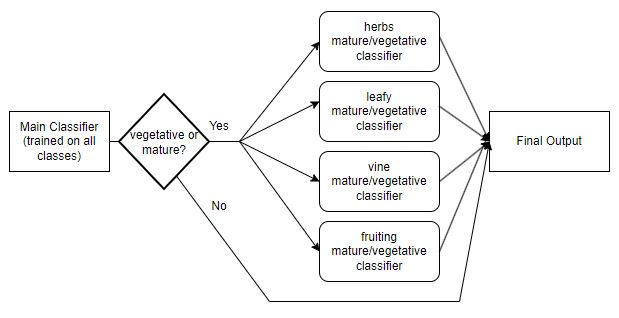
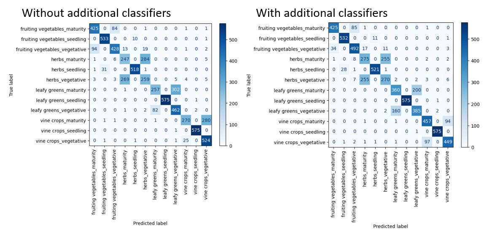
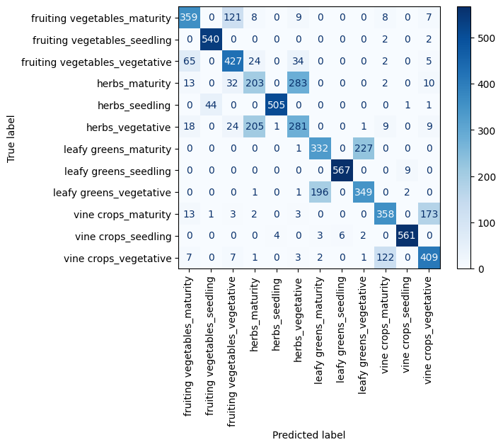
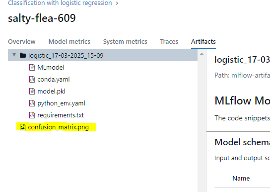
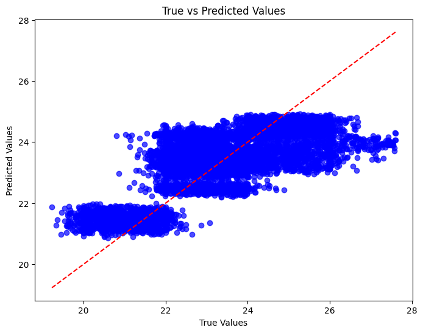
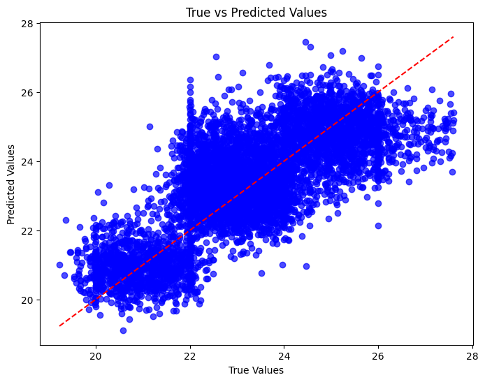

# AIIP 5 Technical Assessment 

Name: Lee Chun Wayne  
Email: chunwayne1996@gmail.com

*note  
I was not able to successfully complete the github actions because I could not upload the db file onto github. I wanted to modify the github actions or add some request methods to download the db into the repo in python but I wasn't sure if that was the correct way. Please add the argi.db file in a data folder in the project root when running.

The repo comes with 4 models and 4 experiment runs that were logged using mlflow, I would be using these as references in my discussion below.

### 📝 Updates 13/04/2025
1. Now, the pipeline and inference modules are run as a module instead of running the script directly. This allows for better modularity and flexibility when executing different parts of the system. To run the pipline
   ```bash
   # From the project root
   mlflow ui
   python -m src.run_pipeline
2. Updated eda.ipynb to show the features which might be useful for separating the problematic classes (maturity & vegetative classes).
3. Trained 4 separate classifiers for each plant type to distinguish between vegetative and maturity stages for each plant type.
4. Stacked these classifiers with the main classifier, if the main classifier predicted either a mature or vegetative plant stage, the respective secondary classifier will reclassify them.  
  

5. After experimenting, all the features except for system location code and previous life cycle plant type were used for the classification problem.  

6. The comparison with and without the additional classifiers are shown below:



7. Added an inference module using Flask to serve the model and a simple front end UI using HTML and bootstrap. The model can be changed by specifying the model name in the conf.yaml file.
   ```bash
   # In the conf.yaml file
   model_path_for_inference: "gradient_boosting_11-04-2025_13-51_classification.pkl"


8. To run the flask server
   ```bash
   # From the project root
   python -m inference.app

   # go to http://127.0.0.1:5000 or local host

9. I also deployed the web app using render :D I did not use docker for this because it was a relatively simple prototype with a small model size.

https://aiip-web-app.onrender.com

## 🚀 About 
This repo contains two main parts: Exploratory Data Analysis - eda.ipynb and the pipeline files.

The EDA contains all the preprocessing steps and some preprocessing steps were done after a few training runs in an attempt to improve classification performance.  

The pipline implements an end to end machine learning workflow and consists of the following file structure:

    .
    ├── .github
    ├──  data         # insert the agri.db file in this folder
    ├── mlartifacts   # this folder is created after running an evaluation for the first time
    ├── mlruns        # this folder is created after running an evaluation for the first time
    ├── raw_data      # this folder is created after saving the db data for the first time
    ├── saved_models  # this folder is created after saving a model for the first time
    ├── src                                       
    │   ├── utils               
    │   ├── data_ingestion.py           
    │   ├── data_preprocessing.py
    │   ├── model_training.py
    │   ├── evaluation.py
    │   └── run_pipeline.py 
    ├── eda.ipynb               # eda notebook
    ├── conf.yaml               #config files for running the pipeline
    ├── requirements.txt        
    └── run.sh

The key components of the pipeline are the python modules within the src folder. The details of each module will be shown in the [description of pipeline](#usage)

## Installation

To install and run, 
   ```bash
   #Clone the Repository
   git clone https://github.com/Printf-Hello-World/aiip5-Lee-Chun-Wayne-037B.git

   #create a virtual environment and activate it
   python -m venv venv

   #install dependencies
   pip install -r requirements.txt

   #start the mlflow server before running pipeline, in a terminal, take note of the uri
   mlflow ui

   #run the script
   bash run.sh  
   ```
   

## Usage
This project includes a configuration file (`conf.yaml`) that allows you to customize various settings.

```
data_ingestion_config:
  db_path : "data/agri.db" 

preprocess_config:
  target_feature: "Plant Type_Stage" 
  features_to_drop: 
    - "EC Sensor (dS/m)"
    - "pH Sensor"
    - "Water Level Sensor (mm)"

model_initialisation_config:
  task: "classification"  
  model_name: "logistic"  
  hyperparams: {"C":1.0, "penalty":"l2"}       
  model_path: ""   

training_method: gridsearchCV 

# new feature, allows additional models for classification of the vegetative and mature stages
use_additional_models: true

param_grid:
  C: 
    - 0.1
  solver:
    - "lbfgs"
  penalty:
    - "l2"
    - "l1"
  max_iter: 
    - 100

mlflow_uri: "http://127.0.0.1:5000"
```

### Config File Field Explanations  
--data_ingestion_config  
db_path: # contains the relative path to the db  
 
--preprocess_config  
target_feature: # change to "Temperature Sensor (°C)" for classification  
features_to_drop: # the feature names must be the same as the column names from farm_table 

--model_initialisation_config  
task: # "regression" or "classification" 
model_name: # For regression: 'elasticnet', 'gradient_boosting' ,'svm'  For classification: 'logistic', 'svm', 'MLP'  
hyperparams: # must conform to sklearn models hyper params eg for logistic regression: {"C":1.0, "penalty":"l2"}       
model_path: # Leave this empty for a new model. if loading an exisiting model, include the model name eg "2025-03-16_09-58-40_svm_classification.pkl"  

--training_method: # gridsearchCV or fit 

--param_grid: # must conform the param_grid params on sklearn for the specific model  

--mlflow_uri: defaults to "http://127.0.0.1:5000", after running mlflow for the first time, you can check what is the uri and change it here if neccessary


## Pipeline Description


### Modules explanation
**data_ingestion:** This module handles the initial ingestion of data from the db and saves it as a csv under the folder "raw_data". If a csv file exists already, the module skips the import from the db and fetches the csv into a pd dataframe  

**data_processing:** All the data preprocessing takes place in this module. The module takes in the dataframe from the ingestion module and processes it. There are 2 key functions in this module:
1. presplit_process: this function handles all the processing **pre** train test split. These include dropping columns, cleaning the data, removing null values, feature engineering such as combining features, and doing one hot encoding. The data is then passed to train test split.
2. postsplit_process: this function handles the processing after train test split. These include imputing and scaling processes as we only want to fit on training data.  
  

**model_training:** This module is designed for flexible model experimentation, allowing users to quickly swap models and perform hyperparameter tuning. This class creates/loads models, trains them using gridsearch or without, and saves the model. Key functions include:
1. set_model: creates an sklearn model based on user hyperparameters or loads an exisiting model.  
2. fit and grid_search_cv: trains the model
3. predict: makes predictions, used in evaluation module
4. save_model: saves the model in the folder "saved_models"  


**evaluation:** This module is responsible for evaluating machine learning models, handling both classification and regression tasks. It also logs results to MLflow for tracking. Key functions include:
1. log_regression: computes and logs the regression metrics (rmse, r^2, mse). The metrics are saved in the mlruns folder. The metrics can be accessed in the mlflow ui under model_metrics. A scatterplot showing the true vales and predicted values are also saved in the mlartifacts folder.
2. log_classification: computes and logs the classification metrics (precision, recall, accuracy). The confusion matrix is also saved as an artifact (in the mlartifacts folder) and can be viewed on mlflow under artifacts for ease of viewing.
3. post_processing: This function attempts to further separate the vegetative and maturity stages in the classification problem after preduictions. It is not used for regression


## Key Findings from EDA and Training

There were a few key findings from the EDA and from training.  

1. There were gaps in the data, especially with important features such as humidity, which plays a role in temperature predict and plant type prediction. To risk losing too much information, simple imputing was used. But K Nearest Neighbours was also used initially but took long to run since there were many datapoints.

2. From online research on plants and observing the pairplots, it could be possible to separate the plant stages based on the nutrient composition. Since each stage of the plant require different levels of nutrients. However, many preprocessing methods like PCA, polyfit and manual feature combing were tried but did not provide a huge increase in performance.  

3. This led to trying to indentify thresholds by observing the KDEs for nitrogen nutrients where I could potentially distinguish between the different stages. This thresholds were implemented in the form of a post prediction filtering where I would filter the plant stages based on a set of thresholds for each plant type. This offered some improvement but more robust strategies are required, and with all nutrients.

4. Non linear methods such as Gradient boosted trees and SVMs performed much better than linear methods such as logistic regression since the relationships between features are non-linear. This was the same observation for both classification and regression.


## Data Processing Techniques

| S/N | Summary of Technique 
|----------|----------|
| 1 | Removed duplicated rows from dataset  |
| 2 | Removed unneccessary characters from columns which should be numerical | 
| 3 | Removed errorneous numerical values that should not be negative |
| 4 | Standardized categorical data |
| 5 | Scaled and Imputed the data after train test split because fitting can only be done on train data |
| 6 | Removed errorneous numerical values that should not be negative |
| 7 | Log transformed skewed features/labels for regression |
| 8 | Removed the outliers using interquartile range for the temperature labels for regression |


## mlflow

I chose to use mlflow to log metrics during evalaution as it gives me options like comparing metrics and experiment runs. I have removed a lot of my training runs and left only 4 results in the repo so that it is less messy. I will be refering to the 4 runs (2 for each task and different models each) in my explaination below. These are the runs from the mlflow dashboard:


## Classification Task

For this task, I needed to classify the plant type stage into 12 categories, 4 types of plants paired with 3 types of stages. 

The pipeline offered three different types of models, Logistic Regressor, Gradient boosted trees, and Support Vector Machines. I chose a linear model first because it was the simplest, and it could provide a baseline accuracy/performance. I used Grid Search CV for all training runs to help tune hyper parameters

For the logistic regressor, the model did not perform very well, this is observed by looking at the confusion matrix:



it can be seen that there were a few misclassifications between different plant types herbs/leafy/fruiting. However, the more glaring issue is the many misclassifications between the different plant stages within the same plant type. For example, the model kept mis-classifying mature herbs with vegetative herbs and vice versa. This led to the post classification EDA where I tried to further separate the classes using PCA, poly fit and manual feature engineering and filtering using a custom function. However, these methods did not improve the results much because the relationships are likely to be non-linear. Therefore, I explored a non linear model: gradient boosted trees.

For the gradient boosted trees, the model performed much better, and the performance was improved slightly after applying the filtering function after prediction. 


The gradient boosting classifier performed much better because the patterns were non-linear, and gradient boosted classifiers improve performance by focusing on misclassifications. New models are built by minimising the error by the older models. This could provide the finer decision boundaries required to separate the plant stages

The main metric used was observing the confusion matrices, these matrices are saved as a png and can be found in the mlartifacts folder or can be viewed in the mlflow ui




I find that the confusion matrix is more useful than metrics such as accuracy for classification problems because it provides finer details on which classes the model are predicting and it helps to come up with custom solutions like filtering to help the model with problematic classes


## Regression Task


For this task, I needed to predict the temperature given a set of features. 

The pipeline offered three different types of models, Logistic Regressor (elastic net), Gradient boosted trees, and MLPRegressor. I chose a linear model first because it was the simplest, and it could provide a baseline accuracy/performance. I used Grid Search CV for all training runs to help tune hyper parameters

For the linear model, the initial results without log transforming the features and removal of outliers are shown in the plot of prediction and true values




The predictions and true values are general in the correct trend which is good, but there are noticeable deviations between the true and predicted values which could mean that the model is underfitting, or there are outliers and there could be scaling issues. Looking back at the KDEs of the features, the distributions do not look very smooth, with distinct peaks for the temperature values. As a result, I log transformed the features and used MLP with 3 layers help improve the regression scores. The results are shown below.




The predicted values are much more bounded to the diagonal line which suggests that the predictions are closer to the true predictions. transforming the features and using a more complex model helped to improve the overall regression performance.


The evaluation metrics used were r^2, rmse and the plot. I found r^2 to be a useful gauge initially. But I found the plots more effective in visualising the spread of predicted data vs true values and it gave more insights to what the model is actually predicting vs true values.


## Considerations for deployment

For deployment, I would want to add two more modules to the pipeline. These are the data_validator and inference module.  

For the data_validator, the module would take in the input data and validate them. eg. raise errors for values that are errorneous (negative values for temperature etc). After validation, the values will be passed to the inference module.

For the inference module, it must most likely be built with frameworks like Flask or FastAPI. This is to create functions that expose the APIs to accept input data and send the data to the server hosting the model to make predictions before returning the predictions to the front end.

The model must be hosted on a server, either locally or on cloud services. To ensure that the model runs on all platforms, using packages like docker can help to manage dependancies 


## FAQ

#### Evaluation module is not running or stuck

Please check if the mlflow_uri: "http://127.0.0.1:5000" is set correctly to your system

#### Error with toggling between classification and regression

Please make sure that the target_feature is set correctly in the conf.yaml. for regression the target feature is "Temperature Sensor (°C)" while for classification it is "Plant Type_Stage"

#### Common training errors

for gridsearchCV, please ensure that the param_grid is the correct format, I have provided examples at the bottom of the conf yaml file

for fit, please ensure that the hyperparameters are set correctly, if you want to use default values, leave it as an empty dictionary {}. Else, follow the format:
hyperparams: {"C":1.0, "gamma":0.1,"kernel":"rbf"} . This is also given at the end of the conf.yaml file 

#### Common load existing model errors
to load an exisiting model, please ensure that the file name is specified in the conf yaml field - model_path: ""  this name is the name of the model that is displayed under the saved_models folder.


