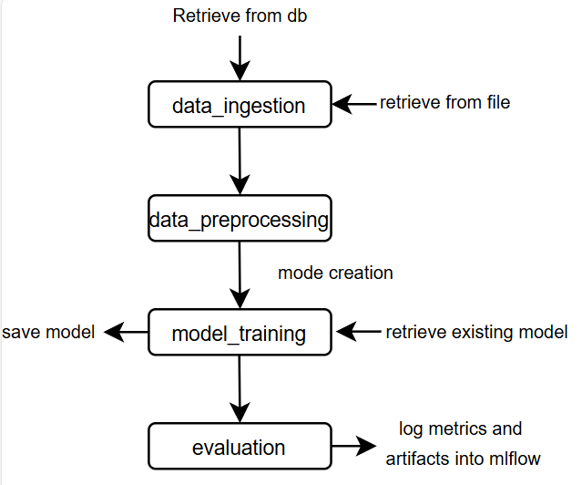
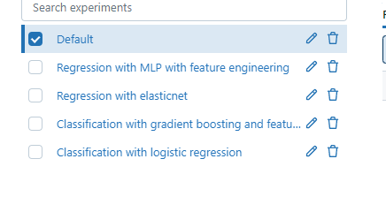
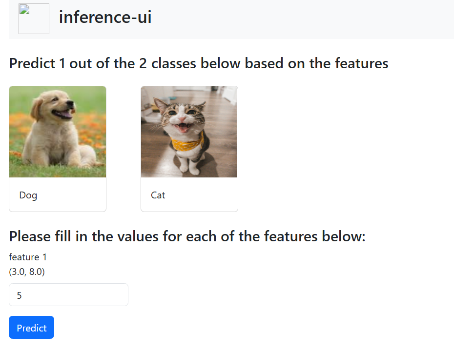

# ML-Pipeline

## 🚀 About 
This repo contains two main parts: training pipeline (src folder) and inference ui (inference folder)

The training pipline implements an end to end machine learning workflow and consists of the following file structure:

    .
    ├── .github
    ├──  data          # create and insert the database file in this folder
    ├──  inference     # inference files
    ├── mlartifacts   # this folder is created after running an evaluation for the first time
    ├── mlruns        # this folder is created after running an evaluation for the first time
    ├── raw_data      # this folder is created after saving the db data for the first time
    ├── saved_models  # this folder is created after saving a model for the first time
    ├── src                                       
    │   ├── utils               
    │   ├── data_ingestion.py           
    │   ├── data_preprocessing.py
    │   ├── model_training.py
    │   ├── evaluation.py
    │   └── run_pipeline.py 
    ├── conf.yaml               #config files for running the pipeline
    ├── requirements.txt        

The key components of the training pipeline are the python modules within the src folder. 

## Installation

To install and run, 
   ```bash
   #Clone the Repository
   git clone https://github.com/Printf-Hello-World/ml-pipeline.git

   #create a virtual environment and activate it
   python -m venv venv

   #install dependencies
   pip install -r requirements.txt

   #start the mlflow server before running training pipeline ignore if using inference ui, in a terminal, take note of the uri
   mlflow ui

   # if using the training pipeline, 
   python -m src.run_pipeline

   # if using the inference ui, 
   python -m inference.app
   ```
   

## Usage
This project includes a configuration file (`conf.yaml`) that allows you to customize various settings.

```
data_ingestion_config:
  db_path : "data/agri.db" 

preprocess_config:
  target_feature: "Plant Type_Stage" 
  features_to_drop: 
    - "EC Sensor (dS/m)"
    - "pH Sensor"
    - "Water Level Sensor (mm)"

model_initialisation_config:
  task: "classification"  
  model_name: "logistic"  
  hyperparams: {"C":1.0, "penalty":"l2"}       
  model_path: ""   

training_method: gridsearchCV 

# new feature, allows additional models for classification of the vegetative and mature stages
use_additional_models: true

param_grid:
  C: 
    - 0.1
  solver:
    - "lbfgs"
  penalty:
    - "l2"
    - "l1"
  max_iter: 
    - 100

mlflow_uri: "http://127.0.0.1:5000"

model_path_for_inference: "model.pkl" # name of the model
```

### Config File Field Explanations  
--data_ingestion_config  
db_path: # contains the relative path to the db  
 
--preprocess_config  
target_feature: # change to "Temperature Sensor (°C)" for classification  
features_to_drop: # the feature names must be the same as the column names from farm_table 

--model_initialisation_config  
task: # "regression" or "classification" 
model_name: # For regression: 'elasticnet', 'gradient_boosting' ,'svm'  For classification: 'logistic', 'svm', 'MLP'  
hyperparams: # must conform to sklearn models hyper params eg for logistic regression: {"C":1.0, "penalty":"l2"}       
model_path: # Leave this empty for a new model. if loading an exisiting model, include the model name eg "2025-03-16_09-58-40_svm_classification.pkl"  

--training_method: # gridsearchCV or fit 

--param_grid: # must conform the param_grid params on sklearn for the specific model  

--mlflow_uri: defaults to "http://127.0.0.1:5000", after running mlflow for the first time, you can check what is the uri and change it here if neccessary

--model_path_for_inference: specify the saved model name which will be used as the model for inference
## Pipeline Description




### Modules explanation
**data_ingestion:** This module handles the initial ingestion of data from the db and saves it as a csv under the folder "raw_data". If a csv file exists already, the module skips the import from the db and fetches the csv into a pd dataframe  

**data_processing:** All the data preprocessing takes place in this module. The module takes in the dataframe from the ingestion module and processes it. There are 2 key functions in this module:
1. presplit_process: this function handles all the processing **pre** train test split. These include dropping columns, cleaning the data, removing null values, feature engineering such as combining features, and doing one hot encoding. The data is then passed to train test split.
2. postsplit_process: this function handles the processing after train test split. These include imputing and scaling processes as we only want to fit on training data.  


**model_training:** This module is designed for flexible model experimentation, allowing users to quickly swap models and perform hyperparameter tuning. This class creates/loads models, trains them using gridsearch or without, and saves the model. Key functions include:
1. set_model: creates an sklearn model based on user hyperparameters or loads an exisiting model.  
2. fit and grid_search_cv: trains the model
3. predict: makes predictions, used in evaluation module
4. save_model: saves the model in the folder "saved_models"  

**evaluation:** This module is responsible for evaluating machine learning models, handling both classification and regression tasks. It also logs results to MLflow for tracking. Key functions include:
1. log_regression: computes and logs the regression metrics (rmse, r^2, mse). The metrics are saved in the mlruns folder. The metrics can be accessed in the mlflow ui under model_metrics. A scatterplot showing the true vales and predicted values are also saved in the mlartifacts folder.
2. log_classification: computes and logs the classification metrics (precision, recall, accuracy). The confusion matrix is also saved as an artifact (in the mlartifacts folder) and can be viewed on mlflow under artifacts for ease of viewing.

**app.py:**
This module defines a flask web server that exposes an api endpoint for a saved ml model (remember to include the model name in the conf.yaml file)

## mlflow

mlflow is used in the evaluation component to log metrics and best_params, artifacts such as confusion matrices and plots are stored using mlflow as well.



## inference-UI

A simple UI using HTML and Flask was created to showcase the predictions of the classification models. Edit the index.html and app.py files inside the inference folder for your specific project. An example of the UI is shown below:




## FAQ

#### Evaluation module is not running or stuck

Please check if the mlflow_uri: "http://127.0.0.1:5000" is set correctly to your system


#### Common training errors

for gridsearchCV, please ensure that the param_grid is the correct format, I have provided examples at the bottom of the conf yaml file

for fit, please ensure that the hyperparameters are set correctly, if you want to use default values, leave it as an empty dictionary {}. Else, follow the format:
hyperparams: {"C":1.0, "gamma":0.1,"kernel":"rbf"} . This is also given at the end of the conf.yaml file 

#### Common load existing model errors
to load an exisiting model, please ensure that the file name is specified in the conf yaml field - model_path: ""  this name is the name of the model that is displayed under the saved_models folder.


